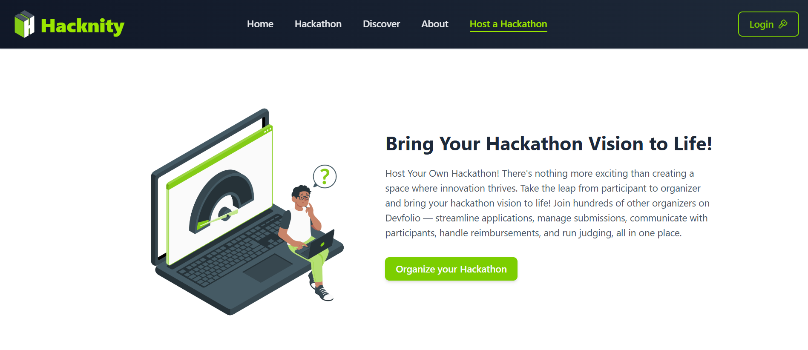

# Hacknity

Hacknity is a modern, community-driven hackathon platform built with React. It enables users to discover, organize, and participate in hackathons, connect with other developers, and showcase trending projects.

## Features

- **Home Page:** Welcome section, upcoming events, registration form, and community highlights.
- **Discover:** Search and filter hackathons by category, view trending projects, and join the community.
- **Dashboard:** Host your own hackathon, view and manage hackathons.
- **Hackathon Listing:** Browse upcoming and past hackathons with detailed cards.
- **Organize:** Step-by-step hackathon creation form with validation.
- **About:** Meet the Hacknity team, read the manifesto, and explore platform features.
- **Login/Profile:** User profile form with education, social links, and contact info.
- **Responsive Design:** Optimized for all devices.
- **Modern UI:** Uses Tailwind CSS for a clean, vibrant look with lime, amber, gray, and black accents.

## Usage

Hacknity is designed to help developers discover and participate in hackathons easily. Here’s how you can use the platform:

- **Explore Hackathons:**  
  Browse upcoming and ongoing hackathons on the Home and Discover pages. Use filters to find hackathons by category or theme that interest you.

- **Join a Hackathon:**  
  Register for any hackathon directly through the platform. You can view detailed information about each event, including timelines, rules, and prizes.

- **Participate and Collaborate:**  
  Connect with other developers by joining community discussions and viewing trending projects. Collaborate, share ideas, and get feedback.

- **Host Your Own Hackathon:**  
  If you want to organize an event, use the Dashboard to create and manage your own hackathon with an easy step-by-step form.

- **Manage Your Profile:**  
  Create or update your profile with your education, skills, social links, and contact information to showcase yourself to the community.

- **Stay Updated:**  
  Receive notifications about hackathon updates, new events, and community highlights to never miss out.

Hacknity works smoothly on all devices so you can participate from anywhere!

## Tech Stack

- **Frontend:** React, Tailwind CSS
- **Routing:** react-router
- **Icons:** lucide-react, flaticon
- **Notifications:** react-hot-toast
- **State Management:** React hooks

## Contributors:

## Contact:

_For any questions or feedback, please contact:_

**Ravikant Tarare**

📩 [ravikanttarare2001@gmail.com](mailto:ravikanttarare2001@gmail.com)

📞 [8275957698](tel:8275957698)